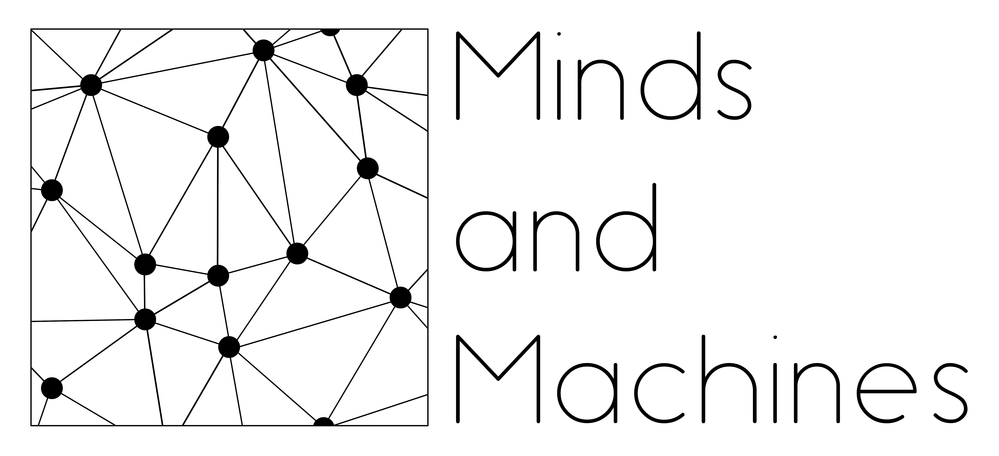

## Cognitive Science, Artificial Intelligence and Education

### Purpose of the Workshop
Learning science as an interdisciplinary subject requires integrating distinct fields and skillsets. In particular, Cognitive Science, which studies and models the human mind, and Artificial Intelligence, which seeks to generate intelligent behavior in machines, share deep theoretical and practical concerns in the domains of education and learning which make interdisciplinary research that spans these two disciplines highly relevant. First, AI is more cognitive than appears at first glance. At the heart of the current AI revolution is a massive transfer of knowledge from humans to machines, in the form of learning from human-labeled and human-structured data. Creating and curating appropriate datasets for training AI systems requires a deep understanding of human-like knowledge representations and the subtleties of converting abstract human knowledge (e.g., what concept or skill a test question assesses) into a machine readable form. Second, AI systems most often have humans as users, as in the case of adaptive learning or assessment, requiring the AI system to maintain human interpretability. Interpretable AI requires the decisions, recommendations and advice delivered to provide sensible interpretations that can be understood by various stakeholders (such as educators, researchers or students), which imposes interesting constraints on learning methodologies for autonomous systems. Finally, Cognitive Science provides proof of concept demonstrations of learned behavior that provide next-generation targets for what AI might achieve. In this workshop we explore these themes through lectures, tutorials, and collaborative projects to enable students to participate in this exciting interdisciplinary research frontier.

By the end of this workshop, students will have gained both conceptual knowledge and practical experience in using advanced machine learning (ML) methods applied to educational settings, domains, and datasets. ML topics include: deep learning, reinforcement learning, and natural language processing; with applications to cognitive modeling and recommender systems in the educational domain.

### When and Where
10 Feb 2020 - 14 Feb 2020, University of Luxembourg, Belval Campus. More details soon.

Most of the workshop will take place in the *Learning Hub 2.02* room, in the second floor of the Luxembourg Learning Centre.

### Workshop Structure
The workshop will span 1 full week (5 days), fulltime.
We will interleave lectures, tutorials and team-project work throughout the day.
At the end of the workshop students present their project.

### Instructors (alphabetic):
 - [Pedro Cardoso-Leite](https://xcit.org/)
 - [Dominic Mussack](https://xcit.org/)
 - [Siwen Guo](https://wwwfr.uni.lu/recherche/fstm/dcs/members/siwen_guo)
 - [Constantin Rothkopf](https://fias.uni-frankfurt.de/~rothkopf/)
 - [Christoph Schommer](https://wwwfr.uni.lu/index.php/recherche/fstm/interdisciplinary_lab_for_intelligent_and_adaptive_systems_ilias/members/christoph_schommer)
 - [Paul Schrater](http://schraterlab.umn.edu/)
 - [Morteza Ansarinia](https://xcit.org/) (Teaching Assistant)

### Students / Audience

The workshop is destined in priority for PhD students from the Unviersity of Luxembourg but is open to anyone for free. Students need to apply (send CV, current project description, recommendations) and are selected by the instructors.

### ECTS
PhD students from the UL may earn 2 ECTS if they
 - register on moodle (link will be provided soon)
 - attend all lectures
 - complete project

Other people may participate to the workshop as well (e.g., Master students) but they won't be able to earn ECTS.

### Pre-requisites
#### Skills:
 - Programming: Participants musk know programming, ideally in Python, in order to complete the projects and earn ECTS. Participants without programming skills may still participate but might not earn ECTS.

 - Math: Background knowledge in math (Linear Algebra, Probability theory) is desirable.

 - English: All courses will be taught in English.

#### Reading list/Preparation for the workshop:
 - [Linear Algebra and Learning from Data by Gilbert Strang](http://math.mit.edu/~gs/learningfromdata/)
 - Edu Data / Learning Analytics review papers (TBD)
 - AI / CogSci review papers (TBD)

#### Setup
Bring your own laptop. If you don't have a laptop you may borrow one from the [Luxembourg Learning Centre](https://wwwen.uni.lu/luxembourg_learning_centre/services/borrowing_laptops).

In this workshop we will mostly use Python3 and Pytorch.

### Workshop Program

#### Day 1:  General Intro

| Time | Topic |
|----|----|
| 08:00-09:00 | Theme intro, welcoming remarks (Cardoso-Leite & Schommer) |
| 09:00-10:00 | AI intro (Schommer) |
| 10:30-11:30 | CogSci Intro (Schrater) |
| 11:30-12:30 | Education Intro	(Cardoso-Leite) |
| 14:00-16:00 | AI Methods / Deep Learning intro (Mussack) |
| 16:30-18:30 | Setting up tool stack; Bootcamp |
| Evening | By the end of day 1, students should be able to tackle the tutorials & program using the adequate tool stack.|

#### Day 2: Recommender Systems

| Time | Topic |
|----|----|
| 08:00-10:00 | RecSys for psychometrics and testing (Cardoso-Leite) |
| 10:30-12:30 | Tutorial |
| 14:00-16:00 | Natural Language Processing & Sentiment analysis in RecSys (Schommer, Guo) |
| 16:30-18:30 | Tutorial |
| Evening | Group formation, topic roundtable.|

#### Day 3: Recommender Systems

| Time | Topic |
|----|----|
| 08:00-10:00 | Deep Learning for structured data RecSys - Game data Schrater |
| 10:30-12:30 | Tutorial - Pytorch factorization recommender |
| 14:00-16:00 | NLP & Sentiment Analysis in RecSys (Schommer, Guo) |
| 16:30-18:30 |  Tutorial NLP anything |
| Evening | Project proposal guidance |

#### Day 4: Cognitive Modeling

| Time | Topic |
|----|----|
| 08:00-10:00 | RL intro (Rothkopf/Schrater) |
| 10:30-12:30 | Tutorial |
| 14:00-16:00 | Ecological behavior, looking:  RL analysis (Rothkopf) |
| 16:30-18:30 | Analysis of eye movements in learning context |
| Evening | Project proposal guidance |

#### Day 5: Cognitive Modeling

| Time | Topic |
|----|----|
| 08:00-10:00 | RL/AI for Learning in Education context (Schrater) |
| 10:30-12:30 | Bridging AI, Cogsci and Education  (Cardoso-Leite + Roundtable discussion) |
| 14:00-16:00 | Student/faculty one-on-one/group meetings:  ALL FACULTY
| 16:30-Evening | Short student presentations (project proposals, to be graded later).|

### How to apply
Participation is free but places are limited and will be filled on a continuous basis. Therefore, if you are interested, apply as soon as possible by sending an email with the following information:
 - a short cv (in particular explain if you have programming experience)
 - a short motivation letter (who are you? how would you benefit from this workshop?)

Applications should be send by email to [contact@xcit.org](contact@xcit.org)

**Deadline: 31 January 2020**
